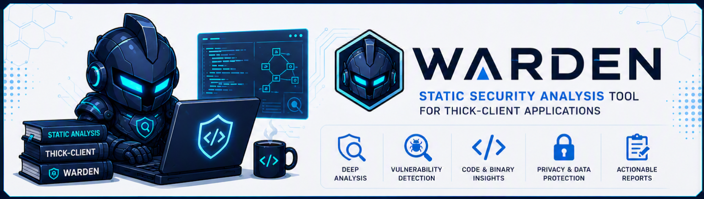

<div align="center">

# Warden

**Static Security Analysis for Thick-Client Desktop Applications**

[](https://www.python.org/)
[](#)
[](#)
[](#)

*Author: [Ankesh Prajapati](https://github.com/Ankesh-Prajapati)*

</div>

---

<h2 id="overview" align="center">Overview</h2>

Warden is a static security analysis tool for thick-client desktop
applications. It scans extracted application folders or individual binaries
**without executing the target**, and produces a deduplicated, professional
HTML report plus optional JSON output.

Supported assessment areas include Windows PE applications, Linux desktop
packages/binaries, macOS app bundles, secrets and configuration exposure,
reverse-engineering exposure, binary hardening, code-signing integrity, and
optional VirusTotal reputation checks.

<h2 id="table-of-contents" align="center">Table of Contents</h2>

- [What Warden Does](#what-warden-does)
- [Key Features](#key-features)
- [Installation](#installation)
- [Quick Start](#quick-start)
- [Desktop App](#desktop-app)
- [CLI](#cli)
- [Secrets And Configuration Intelligence](#secrets-and-configuration-intelligence)
- [Reverse Engineering And Binary Analysis](#reverse-engineering-and-binary-analysis)
- [Signature Analysis](#signature-analysis)
- [Linux Assessment](#linux-assessment)
- [macOS Assessment](#macos-assessment)
- [VirusTotal Reputation](#virustotal-reputation)
- [Custom Rules And Plugins](#custom-rules-and-plugins)
- [Reports](#reports)
- [Project Structure](#project-structure)
- [Known Limitations](#known-limitations)
- [Release Hygiene](#release-hygiene)
- [Legal And Ethical Use](#legal-and-ethical-use)

---

<h2 id="what-warden-does" align="center">What Warden Does</h2>

Warden is static-only. It reads files, parses metadata, extracts indicators,
and analyzes configuration. It does **not** run the target application,
exploit anything, hook processes, bypass protections, or perform dynamic
malware analysis.

<h3 id="core-capabilities" align="center">Core Capabilities</h3>

| Module | Platform | Coverage |
|---|---|---|
| Secrets and Config Exposure | All | Secrets, JWTs, database connection strings, auth/config settings, entropy candidates |
| DLL Hijacking Detection | Windows | Phantom imports, DLL search-order exposure, writable paths, unquoted service paths, generated proof-of-concept test case per phantom import |
| Signature / Integrity Check | Windows | Authenticode presence, certificate details, chain summary, timestamp, publisher consistency |
| RE / Anti-Tamper Exposure | Windows | ASLR/DEP/CFG/SafeSEH, packers, PDB leaks, strings, YARA, crypto/framework indicators |
| Binary Analysis | Windows | Embedded manifests, privilege settings, imported-DLL dependency graph |
| Linux Thick-Client Assessment | Linux | ELF hardening, SUID/SGID, service paths, AppImage/Flatpak/Snap metadata, SBOM inventory |
| macOS Thick-Client Assessment | macOS | Mach-O metadata, signing, notarization, hardened runtime, entitlements, URL schemes |
| VirusTotal Reputation Check | All | Optional SHA-256 hash lookup; upload is separate explicit opt-in |

<h2 id="key-features" align="center">Key Features</h2>

- Native PySide6 desktop app with light and dark themes.
- CLI using the same scanner engine as the desktop app.
- HTML report with executive dashboard, severity summary, risk heatmap,
  MITRE ATT&CK mapping, CWE mapping, confidence score, remediation guidance,
  attack surface summary, grouped findings, and proof-of-concept steps.
- Deduplicated findings in both the desktop table and the report.
- SHA-256 incremental scan cache to avoid rescanning unchanged files.
- Multithreaded scanning where appropriate.
- Custom YARA rules for reverse-engineering scans.
- Python detector plugin hooks for trusted custom modules.
- Application-local desktop reports in `reports/`, suitable for installer
  packaging.

<h2 id="installation" align="center">Installation</h2>

Requires **Python 3.10+**.

**Windows:**

```powershell
PS> git clone <repo-url> Warden
PS> cd Warden
PS> python -m venv venv
PS> venv\Scripts\activate
PS> pip install -r requirements.txt
```

**Linux / macOS:**

```bash
$ git clone <repo-url> Warden
$ cd Warden
$ python3 -m venv venv
$ source venv/bin/activate
$ pip install -r requirements.txt
```

<h3 id="optional-tools" align="center">Optional Tools</h3>

| Tool | Purpose |
|---|---|
| `osslsigncode` | Deeper Authenticode digest verification |
| `readelf` | Deeper ELF hardening/library analysis on Linux |
| `otool`, `codesign`, `spctl` | Deeper Mach-O signing/notarization analysis on macOS |
| `yara-python` | Listed in `requirements.txt`; custom YARA scans are skipped gracefully if unavailable |

<h2 id="quick-start" align="center">Quick Start</h2>

**Desktop app:**

```powershell
PS> python desktop\main.py
```

**CLI, default secrets scan:**

```bash
$ python cli.py scan ./target --output report.html
```

**CLI, common Windows modules:**

```bash
$ python cli.py scan ./target \
    --module secrets \
    --module dll_hijack \
    --module signature \
    --module re_exposure \
    --output report.html \
    --json findings.json
```

**CLI with Linux/macOS inventory hidden:**

```bash
$ python cli.py scan ./target --module linux --hide-inventory
$ python cli.py scan ./target --module macos --hide-inventory
```

<h2 id="desktop-app" align="center">Desktop App</h2>

Run:

```powershell
PS> python desktop\main.py
```

The desktop app supports:

- Folder scans and single `.exe` selection.
- Common modules: Secrets, DLL Hijacking, Signature, RE/Anti-Tamper.
- Platform modules: Linux and macOS thick-client assessment.
- Entropy detection toggle.
- Embedded PE string scanning toggle.
- `osslsigncode` toggle.
- Inventory findings toggle for Linux/macOS scans.
- Optional services-file input for Windows service path checks.
- Optional VirusTotal reputation checks.
- Light and dark theme selection from the Theme menu.
- Filterable, grouped findings table.
- Double-click finding details with evidence, context, remediation, and PoC.
- HTML and JSON reports written to the application-local `reports/` folder.

> **Note:** Desktop settings are persisted through Qt settings storage. The
> VirusTotal API key is stored the same way as other desktop settings; for
> high-security enterprise use, move this to OS credential storage before
> distribution.

<h2 id="cli" align="center">CLI</h2>

```bash
$ python cli.py scan TARGET [OPTIONS]
```

`TARGET` accepts either a directory (scans every file inside it) or a
single file (e.g. `python cli.py scan app.exe`) for a quick one-off scan
of a specific binary — matching the desktop app's "Select EXE" mode.

<h3 id="important-options" align="center">Important Options</h3>

| Option | Description |
|---|---|
| `--output, -o PATH` | HTML report output path |
| `--json PATH` | Also write raw JSON findings |
| `--module NAME` | Repeatable module selector: `secrets`, `dll_hijack`, `signature`, `re_exposure`, `linux`, `macos`, `reputation` |
| `--rules-dir PATH` | Override YAML secret rule directory |
| `--no-entropy` | Disable entropy-based secret detection |
| `--no-pe-strings` | Skip embedded PE string scanning |
| `--services-file PATH` | Optional `sc query` / `wmic service` text output for unquoted service path checks |
| `--no-osslsigncode` | Skip `osslsigncode` verification |
| `--vt-api-key KEY` | VirusTotal API key, also accepted via `VT_API_KEY` |
| `--vt-include-clean` | Report known-clean VirusTotal results as Info |
| `--vt-max-lookups N` | Maximum VirusTotal lookups per scan, default `15` |
| `--vt-upload-unknown` | Upload unknown binaries to VirusTotal; off by default |
| `--incremental` | Enable SHA-256 cache for supported modules |
| `--cache-file PATH` | Override incremental cache file |
| `--yara-rules-dir PATH` | Custom YARA rules folder |
| `--plugins-dir PATH` | Trusted Python detector plugins exposing `scan_file(path)` |
| `--max-workers N` | Worker count for supported scans |
| `--hide-inventory` | Hide Linux/macOS inventory/pass findings |

<h2 id="secrets-and-configuration-intelligence" align="center">Secrets And Configuration Intelligence</h2>

The secrets module scans text/config files and embedded binary strings.

It detects:

- Vendor-style API keys and tokens from `rules/secrets_patterns.yaml`.
- JWTs, with decoded header and payload fields such as `alg`, `exp`, `iss`,
  `aud`, and roles.
- Database connection strings, parsed into host, port, database, username,
  password, and SSL/TLS details.
- Correlated secret bundles, such as username + password + endpoint + API key.
- High-entropy candidate secrets with confidence scoring.
- Structured config formats: JSON, XML, YAML, INI, TOML, SQLite, and plist.
- Authentication, database, logging, TLS, and debug settings.

<h2 id="reverse-engineering-and-binary-analysis" align="center">Reverse Engineering And Binary Analysis</h2>

Windows reverse-engineering checks include:

- ASLR, DEP/NX, CFG, and SafeSEH review.
- Packer and protector signatures.
- PDB/debug path leakage.
- Anti-debug API indicators.
- Interesting strings and indicators: URLs, IPs, domains, registry keys,
  mutexes, GUIDs, named pipes, and suspicious keywords.
- Crypto usage indicators: AES, RSA, RC4, MD5, SHA1, bcrypt, PBKDF2.
- Compiler/framework indicators: .NET, Go, Rust, Delphi, VB, Java, Qt,
  Electron.
- YARA rules from a custom folder.
- Embedded manifest analysis including `requestedExecutionLevel`,
  `autoElevate`, `uiAccess`, and related privilege settings.
- Imported-DLL dependency graph data included in report context.
- Phantom DLL imports include a generated, ready-to-compile proof-of-concept:
  a proxy DLL source stubbing the exact functions the target binary
  actually imports (from the real import table, not guessed), a build
  script for MinGW/MSVC, and step-by-step instructions to confirm the
  hijack is real (a benign `DllMain` marker, not an exploit payload).

<h2 id="signature-analysis" align="center">Signature Analysis</h2>

The signature module checks Windows PE Authenticode metadata:

- Unsigned binaries.
- Expired certificates.
- Self-signed certificates.
- Weak signature algorithms.
- Certificate chain summary where available.
- Timestamp presence.
- Publisher consistency across binaries.
- Unknown publisher indicators.
- Optional `osslsigncode verify` digest mismatch detection.

> Full Windows trust validation, revocation, and timestamp policy decisions
> are best confirmed on Windows with `signtool verify /pa`.

<h2 id="linux-assessment" align="center">Linux Assessment</h2>

The Linux module statically assesses an application folder, package
extraction, or AppImage-style tree.

It checks:

- ELF type, architecture, PIE, NX stack, RELRO, stack canary, Fortify symbols,
  stripped symbols, RPATH/RUNPATH, and linked libraries.
- SUID/SGID files.
- Unsafe systemd service `ExecStart`, `ExecStop`, and `ExecReload` paths.
- AppImage, Flatpak, and Snap metadata.
- Desktop files, package metadata, config files, local databases, logs,
  bundled certificates, persistence artifacts, update URLs, internal/dev
  endpoints, and writable paths.
- SBOM/library inventory for future CVE matching.

Inventory/pass findings can be hidden with the desktop toggle or
`--hide-inventory`.

<h2 id="macos-assessment" align="center">macOS Assessment</h2>

The macOS module statically assesses extracted `.app` bundles and related
application folders.

It checks:

- Mach-O metadata and linked libraries.
- Code-signing status.
- Hardened runtime.
- Notarization status where `spctl` is available.
- Structured entitlement fields.
- Risky entitlements such as debugging or unsigned executable memory.
- Quarantine bypass risks.
- Unsafe URL schemes and insecure `CFBundleURLTypes`.
- LaunchAgents/Daemons, plist/config files, local databases, logs, bundled
  certificates, update metadata, internal/dev endpoints, writable paths, and
  SBOM/library inventory.

> Some macOS checks require macOS command-line tools and are reported as
> best-effort when run from Windows or Linux.

<h2 id="virustotal-reputation" align="center">VirusTotal Reputation</h2>

VirusTotal checks are **opt-in**.

By default Warden sends only SHA-256 hashes to VirusTotal. The binary itself
does not leave the machine unless `--vt-upload-unknown` or the matching
desktop upload option is explicitly enabled.

> Use upload only when you have permission to submit target binaries to a
> third-party service. This is especially important for proprietary client
> software.

<h2 id="custom-rules-and-plugins" align="center">Custom Rules And Plugins</h2>

Secret rules are YAML files under `rules/`.

YARA rules can be stored under `rules/yara` or supplied with:

```bash
$ python cli.py scan ./target --module re_exposure --yara-rules-dir ./my-yara-rules
```

Python detector plugins can be supplied with:

```bash
$ python cli.py scan ./target --plugins-dir ./plugins
```

Each plugin file may expose:

```python
def scan_file(path):
    return []
```

> Python plugins execute code from the selected folder. Treat plugin folders
> as trusted code only.

<h2 id="reports" align="center">Reports</h2>

Reports are self-contained HTML files.

**Desktop reports:**

```text
reports/
```

CLI reports are written to the path passed with `--output`.

The report includes:

- Executive dashboard.
- Severity counts.
- Risk heatmap.
- MITRE ATT&CK and CWE mapping.
- Attack surface summary.
- Confidence score.
- Remediation guidance.
- Grouped/deduplicated findings.
- Detailed evidence and reproduction steps.

<h2 id="project-structure" align="center">Project Structure</h2>

```text
Warden/
  assets/
  core/
    scanner.py
    secrets_module.py
    dll_hijack_module.py
    signature_module.py
    re_exposure_module.py
    linux_module.py
    macos_module.py
    reputation_module.py
    cache_utils.py
    config_intel.py
    plugin_system.py
    finding_grouping.py
    pe_utils.py
    binary_utils.py
    cert_utils.py
    fs_walk.py
    models.py
  desktop/
    main.py
    main_window.py
    scan_worker.py
    finding_dialog.py
    settings.py
    theme.py
  report/
    html_export.py
  rules/
    secrets_patterns.yaml
    system_dlls.yaml
    packer_signatures.yaml
  cli.py
  requirements.txt
  README.md
```

Both interfaces call `core.scanner.run_scan()`. Module output is normalized
into `core.models.Finding` and rendered by `report.html_export`.

<h2 id="known-limitations" align="center">Known Limitations</h2>

- Warden is static-only. It does not prove exploitability.
- Entropy findings are heuristic and can produce false positives.
- VirusTotal hash lookup is reputation data, not a clean/malicious verdict by
  itself.
- Python plugins are trusted code and are not sandboxed.
- Full Authenticode trust validation is best confirmed with Windows
  `signtool`.
- Some Linux/macOS details depend on external platform tools being available.
- SQLite parsing extracts settings and obvious data but does not decrypt
  protected application databases.

<h2 id="release-hygiene" align="center">Release Hygiene</h2>

Before packaging or pushing:

```powershell
PS> python -m compileall .
PS> python cli.py --help
```

Keep generated files out of source control:

- `build/`
- `dist/`
- `__pycache__/`
- `.pytest_cache/`
- `.warden_cache/`
- local virtual environments
- generated reports and installer outputs

<h2 id="legal-and-ethical-use" align="center">Legal And Ethical Use</h2>

Use Warden only against applications you own or have explicit written
authorization to assess. Do not use it against software or systems where you
do not have permission.

---

Built and maintained by **[Ankesh Prajapati](https://github.com/Ankesh-Prajapati)**